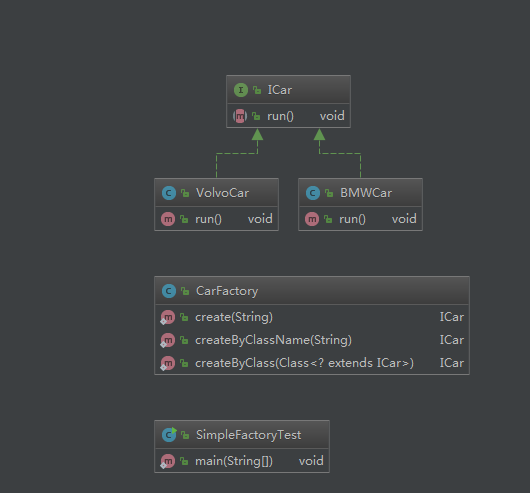
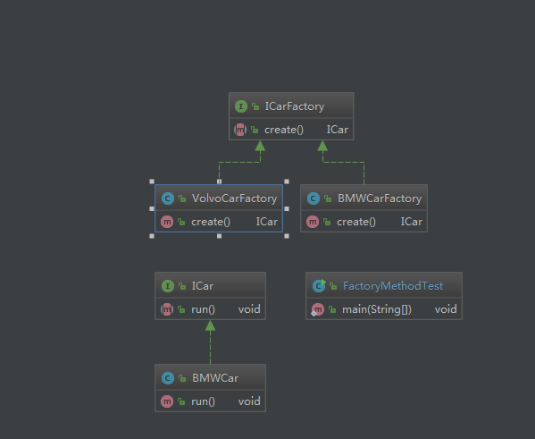
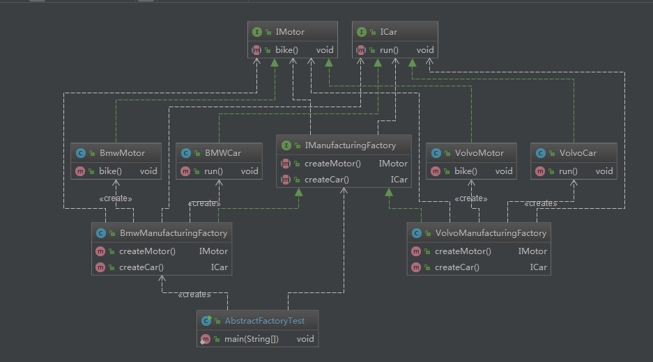

# 工厂模式练习 2019-03-06

## 1、三种工厂模式的类结构图

### 简单工厂模式类图

### 工厂方法模式类图

### 抽象工厂模式类图

## 2、深刻理解产品族和产品等级结构之间的关系
产品族可以理解为一个品牌，产品等级结构可以理解为一个品牌下的多种不同的产品。从工厂方法的一元关系升级到二元关系。
一个品牌下包含多种不同的产品，比如海尔下会生产洗衣机，空调，冰箱等。格力下也会有洗衣机，空调和冰箱产品。
宝马工厂下生产汽车和摩托车，沃尔沃工厂下也会生产汽车和摩托车。宝马和沃尔沃就是一个产品族，汽车和摩托车就是相当于产品等级结构。

## 3、工厂模式代码实现
代码路径： com.venky.vip.day1

## 4、理解简单工厂、工厂方法和抽象工厂的区别
- 简单工厂
是指由一个工厂对象决定创建出哪一种产品类的实例，适用于工厂类负责创建的对象比较少的情况。
优点：只需要传一个参数，就能获取你所需要的对象，无须关心创建细节。
缺点：工厂类职责过重，增加新的产品后需要修改工厂类的判断逻辑，违背开闭逻辑；不易于扩展过于复杂的产品结构。

- 工厂方法
是指定义一个创建对象工厂的接口，但让这个接口的类来决定实例化哪个类，工厂方法将类的实例化推迟到子类。
适用场景：适用于创建对象需要大量重复代码的情况；不依赖与产品类实例如何被创建、实现的细节，一个工厂类通过其子类来指定创建哪个对象。
优点：用户只需要关系所需产品对应的工厂，无须关心创建细节；符合开闭系统，提高系统的扩展性。
缺点：类的个数容易过多，增加了代码结构的复杂度；增加系统的抽象性。

- 抽象工厂
是指提供一个创建一系列相关或者相互依赖的对象接口，无须指定他们具体的类。
使用场景：客户端不依赖于产品实例如何被创建、实现等细节；强调一系列相关的产品对象，一起使用创建对象需要大量的重复代码；
提供一个产品类的库，所有的产品以同样的接口出现，从而客户端不依赖与具体的实现。
优点：具体产品在应用层代码隔离，无须关系创建细节；将一系列的产品族统一到一起创建。
缺点：规定了所有可能被创建的产品集合，产品族中的扩展新产品困难，需要修改抽象工厂的接口。
增加了系统的抽象性及理解难度。
