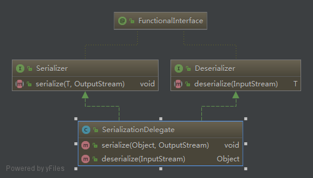

# 委派模式 2019-03-15

## 定义
负责任务的调用和分配，类似代理模式。

## 应用场景
类似的场景，比如老板给项目经理下发任务，项目经理接到任务后经过分解后将任务派发给员工。待员工完成工作后，
再由项目经理汇报工作进度和结果给老板。

## spring中的委派模式
*SerializationDelegate* 类
一个预先设定配置状态的方便的委派，为了公共的序列化需要，实现了 *Serializer* 和 *Deserializer* 自身，所以
也能够传递给更具体的回调方法。

类图

